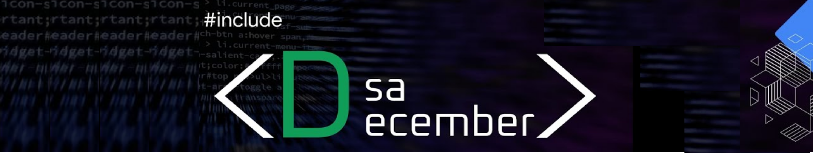

📚 **Your ultimate repository for mastering Data Structures and Algorithms (DSA)!**  
Whether you're a beginner or an advanced coder, this is the perfect place to sharpen your skills and explore new concepts.

---

## 🧠 Why This Repository?

We believe that **learning by doing** is the best approach.  
This repository offers a curated collection of **challenges, exercises, and examples** to help you master DSA concepts in a fun and engaging way.  

From **Big O notation** to **sorting algorithms**, from **graph theory** to **dynamic programming**, we've got everything you need to become a DSA expert!

---

## 👀 What's Inside?

Here’s what you’ll find in this repository:

| Feature                          | Description                                                                 |
|----------------------------------|-----------------------------------------------------------------------------|
| ✅ **Challenges & Exercises**    | A wide range of problems to test your DSA skills.                          |
| ✅ **Detailed Explanations**     | Step-by-step solutions for every problem.                                  |
| ✅ **Sample Code**               | Code snippets in multiple programming languages.                           |
| ✅ **Optimization Tips**         | Tricks to make your code faster and more efficient.                        |                |

🎓 Let's Learn Together!
At DSA IN DECEMBER, we believe that learning is a never-ending journey.
We're always looking for ways to improve and grow. If you have any suggestions or feedback, feel free to:

Open an issue in this repository
Reach out to us directly
Together, we can become the best DSA developers out there! 💪